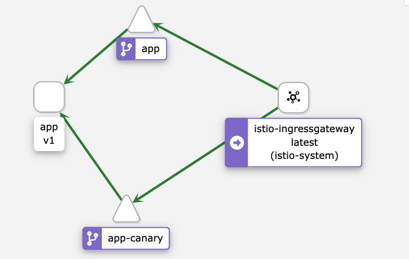

# Testing Argo Rollouts
_This repo is for testing ArgoCD Rollouts in Istio._

## Install ArgoCD Rollouts
```
kubectl create namespace argo-rollouts
kubectl apply -n argo-rollouts -f https://github.com/argoproj/argo-rollouts/releases/latest/download/install.yaml
```

## Install & Configure Istio
_Install Istio using the demo profile and include the add/ons._   
**Install**
```
curl -L https://istio.io/downloadIstio | sh -
cd istio-1.10.2
istioctl install --set profile=demo -y |  ISTIO_VERSION=1.10.2
kubectl label namespace default istio-injection=enabled
kubectl apply -f samples/addons
kubectl apply -f samples/addons
cd ..
```   
**Configure**
_Notice in the VirtualService there is a destination called `app-canary`. This will receive traffic during a rollout. Also noticed the virtual service has a .spec.http[0].name. We will reference this in the Rollout manifest._
```
kubectl apply -f k8s/gateway.yaml
kubectl apply -f k8s/vs-app.yaml
```   

## Create the kubernetes services
_You will need to install a canary service along side the app service to receive traffic during a rollout._
```
kubectl apply -f k8s/service.yaml
```

## Create a Rollout
_Rollouts are replacements for deployments. We will deploy our app with the rollout. The rollout also references the virtual service, .spec.strategy.canary.trafficRouting.istio.virtualService.route_
```
kubectl apply -f k8s/rollout.yaml
```   

## Interact with your Rollout
_Check your pods and make sure they are coming up._
```
kubectl get pods
```

_Look at the Rollout status. (in a new terminal)_
```
k argo rollouts get rollout app --watch
```

_Look at Kiali in a terminal to watch the new rollout (in a new terminal). Look at the graph in the default namespace_
```
istioctl dashboard kiali
```

_Start sending requests through the Gateway._
```
for x in $(seq 100); do curl -X POST -d '{"Arr":[2,345,43,99,3,111,61,2,1,9,1]}' http://$(k get svc/istio-ingressgateway -n istio-system -ojsonpath='{.status.loadBalancer.ingress[0].ip}'); echo "\n"; sleep 5s; done
```

_Deploy a Canary verion of the app._
```
# Rollout v2
kubectl argo rollouts set image app "*=docker.io/cmwylie19/test-argo-rollouts:v2"

# Rollout v1
kubectl argo rollouts set image app "*=docker.io/cmwylie19/test-argo-rollouts:v1"
```

_Checkout Kiali._


## Cleanup
```
rm -rf istio-1.10.2
kubectl delete ro --all
kubectl label namespace default istio-injection-
kubectl delete svc app,app-canary
kubectl delete hpa,svc,deploy -n istio-system --all
kubectl delete gw app-gateway
kubectl delete vs app
kubectl delete ns istio-system
```
